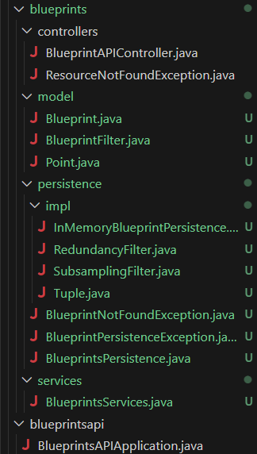
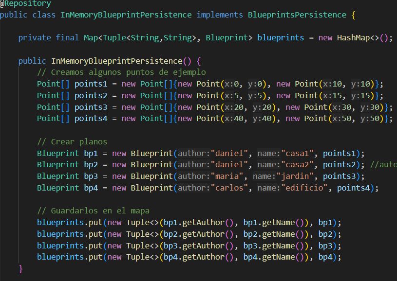
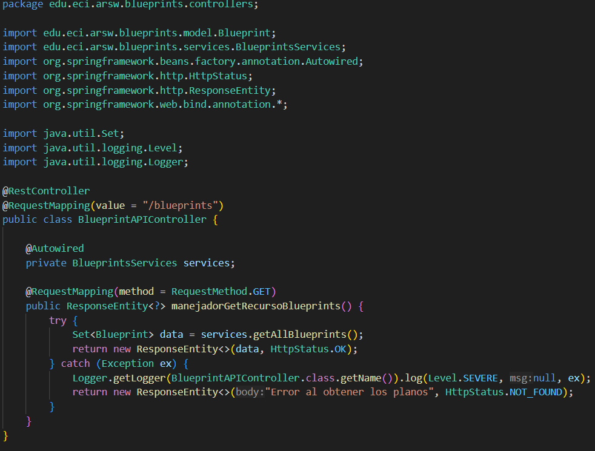
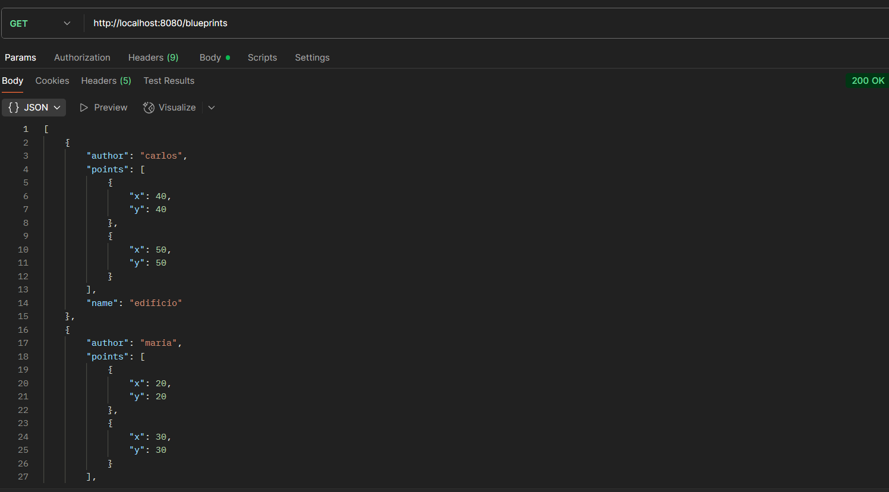

## Lab ARSW4

## Daniel Ricardo Ruge Gomez

### Parte I

#### 1

Integración del proyecto base suministrado sin archivos de configuración (reorganice algunas clases respecto al lab anterior)

 

#### 2

agregamos un constructor en InMemoryBlueprintPersistence que inicialice algunos planos de ejemplo al arrancar la aplicación cumpliendo la condición de que dos sean del mismo autor.

### 3

Modifique la clase BlueprintAPIController en base al ejemplo dado, la clase usa @RestController para exponer endpoints REST que devuelven directamente JSON, con @RequestMapping("/blueprints") se define la ruta base del recurso. A través de @Autowired se inyecta el servicio BlueprintsServices, y el método manejadorGetRecursoBlueprints() atiende las peticiones GET /blueprints devolviendo todos los planos en JSON. Finalmente, ResponseEntity permite enviar tanto los datos como el código HTTP correspondiente (200 OK en éxito o 404 en error).

### 4

hacemos la solicitud GET y verificamos la respuesta exitosa y la funcionalidad del filtro

